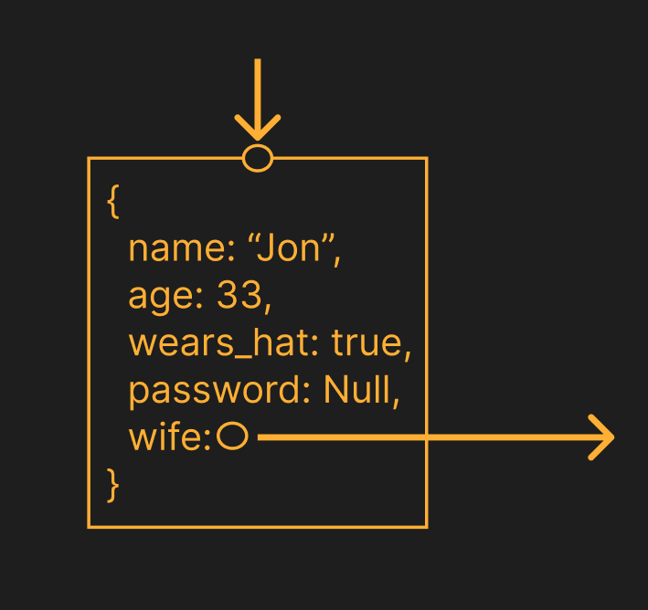
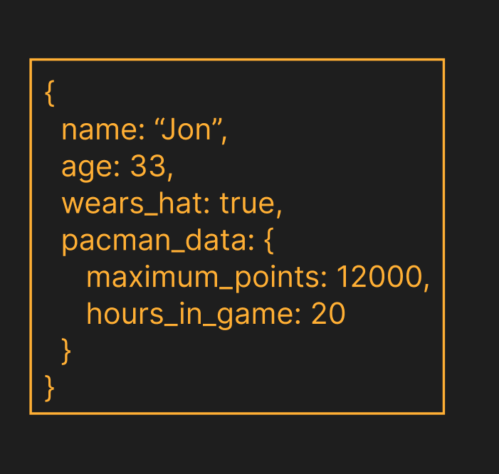
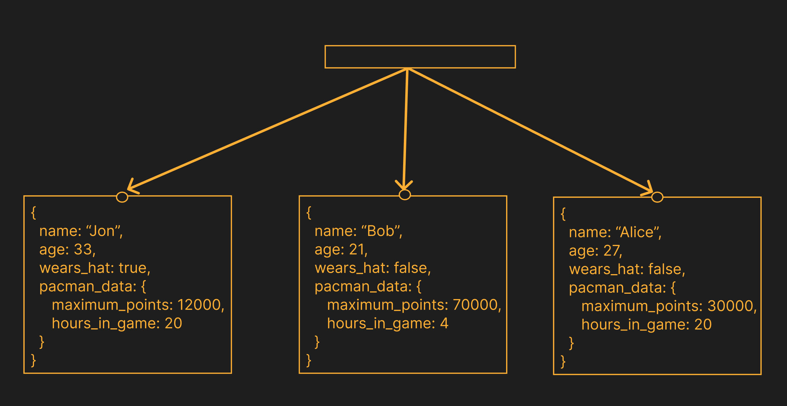

# Data Model

COG implements its own data model with node, edges and hyperedges.

## Nodes

A node is a container for an object.



Object fields are dynamically typed: string, number, bool, null, link or subobject. A link is a reference to another entity — node, edge, hyperedge, or a sub-object inside another field.

A node can be *free* — having no incoming or outgoing edges and not being a member of any hyperedge.

### Subobjects



A *subobject* is a field inside an entity's `Object` whose value is itself an `Object` (or any nested field reachable through a chain of object-typed fields). A subobject has **no identity of its own**: it doesn't appear in `iter_entities`, has no UUID, and is addressed by a `GlobalPath` of the form `<entity-uuid>/<field>[/<field>...]`.

Subobjects are not entities. They cannot:
- be classified by `get_type` (which is for ids);
- carry an *attached object* (see below);
- be the target of `attach_obj`.

Subobjects **can** be:
- the source or target of an edge,
- a member of a hyperedge,
- the target of a `Field::Link` (i.e. `Pointee::Path`).

## Edges

An edge is a directed link between any two entities — nodes, suboject, edges, or hyperedges — so any combination of endpoints is allowed, including self-loops.

An edge whose at least one endpoint is itself an edge or hyperedge is called a *metaedge*. Metaedge is a classification, not a separate storage type: every metaedge is just an edge.

## Hyperedges



A hyperedge groups an arbitrary number of pointees (entities or subobjects) without imposing direction or pairing. A hyperedge is essentially a subgraph or what will later be called a `space`.

## Attached objects

An *attached object* is an `Object` that piggy-backs on top of an edge or hyperedge, sharing its id. It lets structural elements (edges, hyperedges) carry data without introducing a proxy node.

## Invariants

- *Endpoints exist.* Every edge has both endpoints alive. Deleting an entity cascades to all edges that have it as source or target, and recursively to metaedges that depended on those edges.
- *Hyperedge membership.* When a member of a hyperedge is deleted, it is removed from the hyperedge. A hyperedge that becomes empty is itself deleted (which in turn cascades to any edges that have it as source or target).

# Coding model

So, how to interact with the database using code and organize it?

## Dialect and not query DSL

Instead of creating a query language, COG's proposes a Rust dialect. When we say dialect, we mean that the Rust side provides intrinsics and macros that will be processed by the JIT.

## DB stored code

### For what?

The primary way to build COG applications is to place code within the database. This aligns with DAD: firstly, we strive to maintain code and data locality, and secondly, we want to inspect the code just-in-time (JIT) for subsequent optimizations.

### Your first module

Ok, lets create new folder `hellow-view`.

Next, create `Cargo.toml` with following code:

```toml
name = "hello_view"
version = "0.1.0"
edition = "2024"

[lib]
crate-type = ["cdylib"]

[dependencies]
sdk = { path = "../../crates/sdk" }

[profile.release]
opt-level = "s"
lto = true

[workspace]
```

Ok, next create file `src/lib.rs` with following content:

```rust
    use sdk::{Field, Graph, Object, view};

    #[view]
    fn hello_view(g: &mut Graph) {
        let mut obj = Object::new();
        obj.insert("Hello".to_string(), Field::String("World".to_string()));
        g.add_node(obj);
    }
```

Ok, we just wrote function thats chang graph thats function call `mutator`.

Our code should work, but we haven't used this code yet. How can we verify that everything works? Well, we'll do that in the next section.

# Client's

In the previous section, we created a simple WASM module. Now let's create two clien't and verify that's all work correct.

<!-- TODO -->

# Reactivity and incrementality

Before we continue we need to be familiar with two concepts reactivity and incrementality

### What reactivity is?

Imagine we have the following code:

```
    let v3 = v1 + v2;
    let v4 = v3 + v5;
```

For it we can construct the following DAG:

```
    v1 ──┐
         ├──▶ (+) ──▶ v3 ──┐
    v2 ──┘                 │
                           ├──▶ (+) ──▶ v4
    v5 ────────────────────┘
```

Each node here is either an input (`v1`, `v2`, `v5`), an operation (`+`), or a derived value (`v3`, `v4`). Edges encode the *data dependencies*: `v3` depends on `v1` and `v2`; `v4` depends on `v3` and `v5`.

Reactivity is the property that, whenever an input changes, every value that transitively depends on it is recomputed automatically — and nothing else is touched. If the user updates `v1`, the runtime walks the outgoing edges from `v1`, sees that `v3` is dirty, recomputes `v3`, then sees that `v4` depends on `v3` and recomputes `v4` too. If instead only `v5` changes, `v3` is left alone and just `v4` gets recomputed. The DAG tells the runtime exactly which work is needed and which work it can skip.

### What about `if` and `for`?

Real code is not just a chain of `let` bindings — it has control flow. How does the DAG cope?

**Conditionals (`if`, `match`, early `return`).** A branch that wasn't taken on the previous run may be taken now, which means the set of dependencies of a value is itself dynamic — it depends on the inputs. A purely static DAG cannot capture this. The standard fix is to record dependencies *as they are actually read* during a run, so each recomputation rebuilds its own dependency set. This is what frameworks like Salsa and Adapton do, and what COG does too: the DAG shown above is the trace of one particular execution, not a fixed schema. A different input may produce a different DAG.

**Loops (`for`, `while`) over fixed data.** A loop with a known iteration count is just unrolled into the trace: each iteration's reads and writes become more nodes and edges in the dynamic DAG. There is nothing special to handle — the graph is simply larger.

**Loops over a collection that itself changes.** This is the genuinely hard case. If you write
```
    let total = items.iter().map(price).sum();
```
and a single `item` is added, naive reactivity sees that `items` changed and reruns the entire loop, even though only one element is new. The DAG model has no way to express «the dependency on `items[3]` changed but `items[0..3]` and `items[4..]` did not». This is exactly the gap that **differential dataflow** fills: collection operators (`map`, `filter`, `join`, `reduce`) consume *diffs* (`+item`, `-item`) and produce diffs, so adding one element costs O(1) work, not O(n). In COG, scalar-typed view nodes use the Salsa-style trace described above; collection-typed view nodes (operating on `Space`/`Graph`) lower to differential operators instead.

#### A note on the dependency graph itself

Independently of how the source code looks, the *graph of derived values* must stay acyclic — `a` cannot depend on `b` while `b` depends on `a`, because there is no fixed order in which to recompute them. Feedback between reactive values is expressed as an explicit time step (a new version of the graph), not as a cycle in the dependency graph.

<!-- TODO -->

# Input

Something populates the database. Such functions are called `inputs`. Inputs are asynchronous functions that will cause a recalculation in the database at the moment async is triggered.


In traditional databases, views are created using schemas and modified by queries. COGs use functions to create views.

You use macro `view` for marking function. That's create new a incrimental materialized view. That is, this is the function fn(g1, g2, ...) -> gr, that's accept some spaces.

```rust
    #[view]
    fn hellow_view(#[path = "/graph1"] g1: Graph, #[path = "/graph1"] g2: Graph) -> Graph {

    }
```

You can path singl graph parameter thats mean that root (whole graph) be used as parameter.

Data base can also contain `procedure` it interface the same as `view` function. The different that procedure doesnt recall by observed (captured) space changes. Insted this function can be called by client by three different way: fist snapshot based - function call once and return result; second - update by recall, the first time you call it, you get a snapshot, later, when you call it again, you get delta patches; third - observation, the first time you call it, you receive a snapshot, then, with each change in the database, it automatically sends you a delta patch.

# Queries

